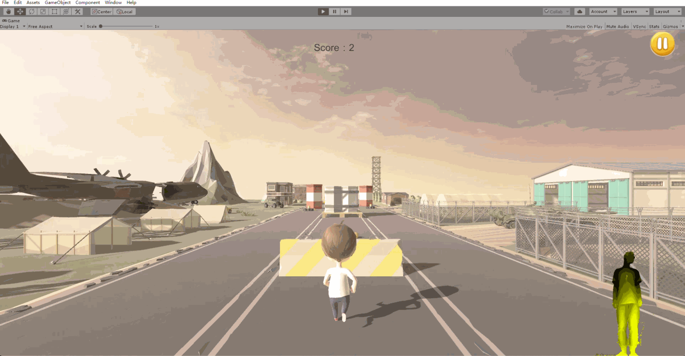

# Running Man

    
     
    
    
    

A 3D Parkour Game based on **Unity 3D** and **Kinect 2.0**.  Different types of input devices are supported to enhance the game experience, including Kinect, Keyboard, and Mouse. (Each contained in a different branch)

## Game Logic and Functionality

- **Start Panel**
  - **View information**
    - Click `information` button with a mouse to view the information of the developers of the game. 
    - Or you can attempt to make a gesture of `ZoomIn` (Elbows down, palms at least 0.7 meters apart, and then slowly close palms together) before the Kinect camera, then the information panel is displayed.
    - If you want to return to the main page, then either try to click the `close` button, or to make a gesture of `ZoomOut` (Elbows down, fold both palms together, and then slowly separate them) before the Kinect camera.
  - **Two ways to launch the game:**
    - Move your mouse and click the `start` button to start the game with keyboard as the input device.
    - Run in the spot before the Kinect camera, once the Kinect identifies your actions, the game starts with Kinect as the input device.
  - **Quit the game:**
    - Click the `Exit` button and then quit the game.
    - Make a gesture of `Wave` (Straighten your right/left arm forward, and then wave your right/left arm) before the Kinect camera.
  
  
  
- **Main Scene**

  - **Jump**

    - In keyboard mode, player can use the space bar to control the character to jump. Player cannot jump over some high barriers.
    - In Kinect mode, player can jump on the spot to control jump, making sure that the Kinect can detect your knee bending.

    

  - **Squat**

    - In keyboard mode, player can use the down arrow key ⬇️ to control the character to squat.
    - In Kinect mode, player can make a gesture of squat to control squat.

    

  - **Move**

    - In keyboard mode, player can use the left arrow key ⬅️ or right arrow key ➡️ to control the character to move to the left/right.
    - In Kinect mode, player can make a gesture of waving to the left/right to control the movement of the character.

    

  - **Restart**

    - In keyboard mode, once the player fails, he can use the mouse to click the `restart` button to restart the game.
    - In Kinect mode, player can make a gesture of wave to restart the game.

    

  - **Pause**

    - In keyboard mode, player can click the pause button in the upper left corner to pause the game.
    - In Kinect mode, player can raise his hands to pause the game.

## Installation and Usage

This game does not need to be installed. Player can download the [released version](https://github.com/154544017/RunningMan/releases) (`RunningMan.app` for macOS and `RunningMan.exe` for Windows 10), and launch the game by double click on the executable file.

Then fill the game configration, choose the screen resolution, graph quality, and whether windowed. At last, you can click `Play!` to start the game. 

Unfortunately, the macOS version do not support Kinect at present.

## Report

If you are interested in the implementation details of the project, see [Report](report.md).

## Contribution

See [Contribution](https://github.com/154544017/RunningMan/graphs/contributors).

## License

This project is open source licensed under the Apache 2.0 License. Please see the [LICENSE file](LICENSE) for more information.
